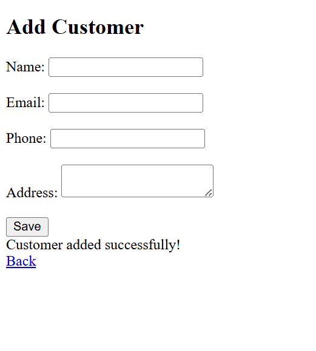
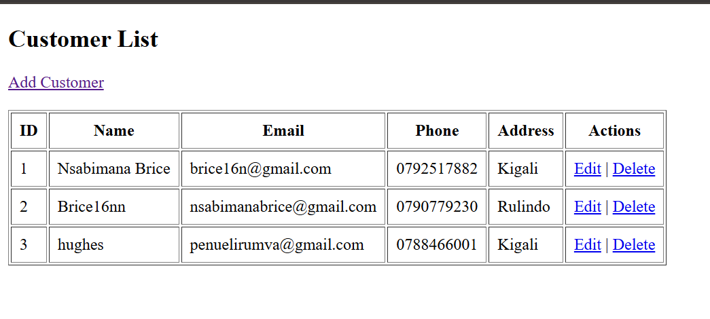
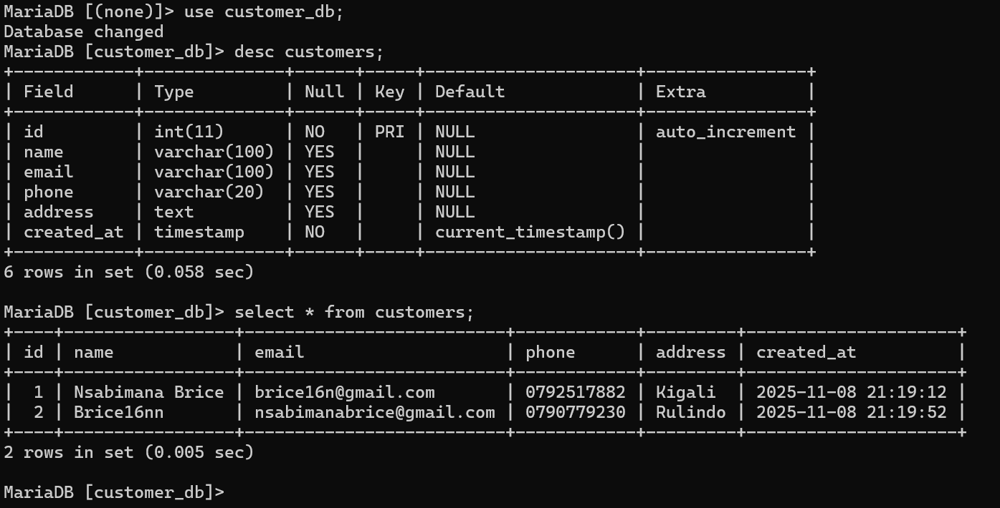

# Assgnment5-php
**Customer Registration System — PHP & MySQL CRUD**
Project Description

This project is a Customer Registration System built using PHP & MySQL. It demonstrates full CRUD functionality:

Create Customer

View Customer Records

(Edit & Delete can be added)

The system allows the user to register new customers and display them in a table.

**CRUD Operations**

Technologies Used
Technology	Purpose
PHP	Backend server logic
MySQL	Database
HTML	Front-end forms and views
phpMyAdmin	Database management
XAMPP / WAMP	Server environment
**Database Setup**
SQL to create database & table
CREATE DATABASE IF  customer_db;
USE customer_db;

CREATE TABLE  customers (
  id INT AUTO_INCREMENT PRIMARY KEY,
  name VARCHAR(100) NOT NULL,
  email VARCHAR(100) NOT NULL,
  phone VARCHAR(20),
  address TEXT,
  created_at TIMESTAMP DEFAULT CURRENT_TIMESTAMP
);

**Folder Structure**
Assgnment5-php/db.php/add.php/index.php

**Features**

Add customer with name, email, phone & address

View customer list

Validates required fields

Stores data in MySQL database

 Screenshots Included

 Customer Form Page
 
 Customer List Output

 Database Table Screenshot
 

 CRUD SYSTEM - TEXT FILE

This file contains the basic CRUD operations code used in the PHP
project.

  -------------------------------------------------------------------------------------------
  1. CREATE (add.php)
  -------------------------------------------------------------------------------------------
  <?php include ‘auth.php’; include ‘db.php’;

  if(isset($_POST[‘save’])){ st=conn->prepare(“INSERT INTO
  customers(name,email,phone,address) VALUES(?,?,?,?)”);
  $st->bind_param("ssss",$_POST[‘name’],_(P)OST[′email′],_POST[‘phone’],$_POST[‘address’]);
  $st->execute(); echo “Added”; } ?>
  -------------------------------------------------------------------------------------------

2. READ (index.php)

query(“SELECT * FROM customers”); while(row=r->fetch_assoc()){ echo
$row['name']." | ".$row[‘email’].” |
“.$row['phone']." | ".$row[‘address’].”“; } ?>

  ------------------------------------------------------------------------------------------------
  3. UPDATE (edit.php)
  ------------------------------------------------------------------------------------------------
  <?php include ‘auth.php’; include ‘db.php’;

  id=_GET[‘id’]; r=conn->query(“SELECT * FROM customers WHERE id=$id”)->fetch_assoc();

  if(isset($_POST[‘update’])){ st=conn->prepare(“UPDATE customers SET
  name=?,email=?,phone=?,address=? WHERE id=?”);
  $st->bind_param("ssssi",$_POST[‘name’],_(P)OST[′email′],_POST[‘phone’],_(P)OST[′address′],id);
  $st->execute(); echo “Updated”; } ?>
  ------------------------------------------------------------------------------------------------

4. DELETE (delete.php)

query(“DELETE FROM customers WHERE id=$id”); header(‘Location:
index.php’); ?>

 